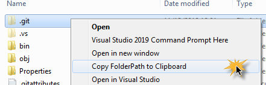
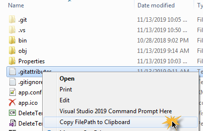
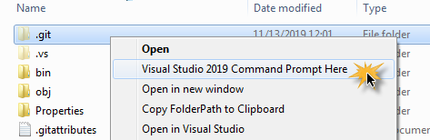

# PathToClip
This mini-applet is used to provide one or more custom right-click context-sensitive menus in MS Windows Explorer for copying a selected *file* or *folder*'s path to the clipboard and/or optionally
enable opening a *Visual Studio Command Prompt* with its path automatically set to the path of the selected file or folder.

The following shows the **Copy Folder Path to Clipboard** context menu item:

The following shows the **Copy File Path to Clipboard** context menu item:

The following shows the **Visual Studio Command Prompt Here** context menu item:

