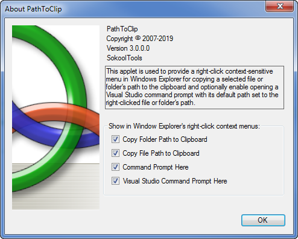

# PathToClip
Running this mini-applet will provide a choice of adding several custom right-click context-sensitive
menus into Microsoft Windows Explorer used for easily copying a selected *file* or *folder*'s 
path to the clipboard and/or enabling the opening of a standard *Windows Command Prompt*,
or when installed, the latest *Visual Studio Command Prompt*, in both cases, the prompt has its path
automatically set to the path of the right-clicked file or folder.

The following shows the **Copy Folder Path to Clipboard** context menu item:

The following shows the **Copy File Path to Clipboard** context menu item:

The following shows the **Visual Studio Command Prompt Here** context menu item:

For more information regarding this application, consult the [Help](Help/help.htm) documentation.
